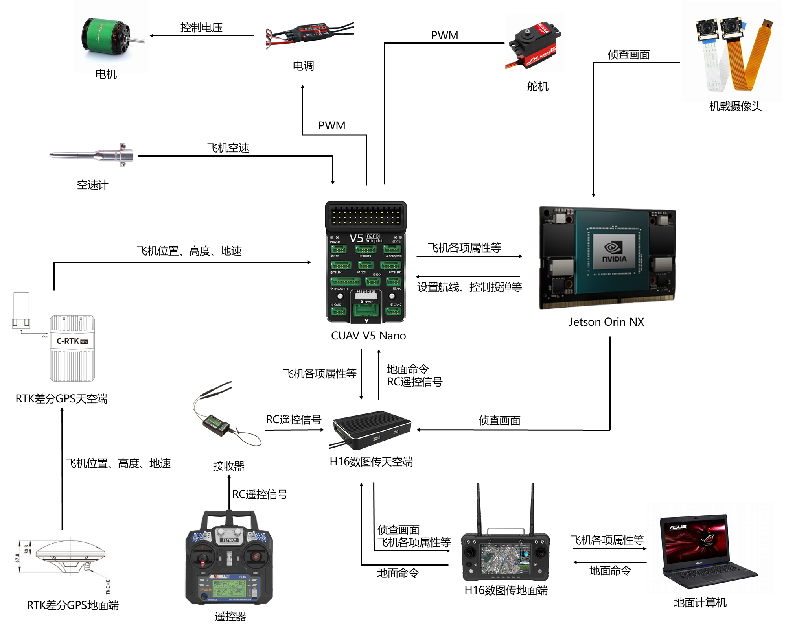

# 技术说明

by 徐锦豪 2024.10

写在前面：以下各项技术几乎都有官方文档，最好先从官方文档学习各项技术，遇到问题也应该先查官方文档或者官方github的issues，然后再在搜索引擎查或者问GPT。PS：GPT适合用来写代码片段或者写小工具，不要把所有代码逻辑都让GPT来写。对于一些重复性强的小问题，例如写个批量给图片命名的python脚本，就非常适合交给GPT来干。

## 飞机相关

### 名词解释

1. 飞控：飞控又称飞行控制器，用于对飞行器的其他系统及元器件起到协同控制的元件，可以理解为飞机的“小脑”（与之对应的是机载电脑，承担高级工作，相当于“大脑”）。
2. 固件：Firmware，可以理解为固定在硬件中的程序。飞控固件就是烧录进飞控处理器中的一套程序，用于控制飞机等。
3. 飞控参数：即飞控程序中的参数，相当于留给用户的API接口，让用户根据实际情况设定这些值，让飞机更能按照自己的需求飞行。（详见“飞控参数调整”文档）
4. 航点：飞控会按照给定的航点进行飞行，航点命令有很多，常用的有takeoff、waypoint、do_jump、land。航点命令有可调的参数，例如takeoff有pitch和alt，注意调整为合适的值。
5. 飞行模式：飞控中有不同的飞行模式，例如Manual, Stabilize, Auto, RTL, Circle, FWBA, Autotune等，具体请查阅文档，正常情况下只需要用到前三个即可。
6. 飞行日志：飞控会保存每次解锁后的日志（相当于黑匣子），通过地面站或者SD卡下载后，可以分析飞机飞行的各项属性。
7. 仿真：有一些程序可以用来模拟飞机的飞行，一般用来测试规划的航线等。
8. 各种航电设备：
    
    
    

### Mission Planner地面站

[MP官方文档](https://ardupilot.org/planner/)

简介：地面站是用于连接飞控的地面控制站，可用于查看飞机状态、规划航线、发送指令、烧写参数等。

掌握：

1. 调出飞机实时信息
2. 航点的规划、上传、读取、保存
3. 给飞控烧写固件
4. 飞机飞行前进行必要的校准：加速度计校准、遥控器校准、电调校准、指南针校准、空速计校准等
5. RTK的收敛与位置保存
6. 理解飞机某些参数的意义并会烧写参数（具体见“飞控参数调整”文档）
7. 下载飞控日志
8. 其他未尽事宜

### DroneKit库

[DroneKit文档](https://dronekit.netlify.app/)

Github：https://github.com/dronekit/dronekit-python

简介：DroneKit-Python是一个用于控制无人机的Python库。DroneKit提供了用于控制无人机的API，其代码独立于飞控，单独运行在机载电脑（Companion Computer）或其他设备之上，通过串口或无线的方式经MAVLink协议与飞控板通信。

（详见“DroneKit记录”文档）

[DroneKit记录](../DroneKit记录/DroneKit记录.md)

### SITL仿真

简介：SITL（Software In The Loop）仿真是一种在开发无人机时常用的技术。它允许开发者在实际硬件部署之前，在计算机上模拟整个系统的行为。今年用的主要是Ardupilot开发的SITL。

（详见”SITL调试”文档）

[SITL调试](../SITL调试/SITL调试.md)

## Linux相关

### Linux

简介：Linux是一个开源的操作系统，许多开源软件只能在Linux上运行。Linux有许多发行版，Ubuntu就是其中之一。树莓派和英伟达Jetson使用的操作系统为定制化后的Ubuntu。

掌握：

1. 常用操作命令：ls、cd、mkdir、touch、rm等
2. BASH基本命令并会编写sh脚本
3. 配置开机自启动脚本（crontab或gnome自带的开机自启动）
4. vim编辑器的使用（可选）
5. 其他需要在Linux下完成的任务

## 图像识别相关

### NumPy

[NumPy 参考手册 | NumPy](https://www.numpy.org.cn/reference/)

简介：NumPy是一个使用Python进行科学计算的基础包，它提供了强大的多维数组对象和一系列用于处理数组的工具，是许多其他库的重要依赖。例如，在神经网络里，数据都被转换成N维数组（ndarray），YOLO推理返回的结果也是一个N维数组。OpenCV里，图像也是用NumPy的ndarray形式储存。我们最需要了解的也就是ndarray数组。

### YOLO神经网络

[YOLO官网](https://docs.ultralytics.com/)

Github：https://github.com/ultralytics/ultralytics

简介：YOLO (You Only Look Once)是一种流行的目标检测和图像分割模型，于2015年推出，因其高速度和准确性而迅速受到欢迎。今年我们用于识别靶标的模型为YOLOv8-obb变体，obb意味着Oriented Bounding Boxes，即旋转目标检测。用于识别数字的为YOLOv8默认的detect模型。

掌握：

1. 使用RoboFlow等工具进行数据集标注、预处理与导出。
2. 进行YOLO模型的训练
3. 在python中使用YOLO模型进行推理并且会使用推理结果
4. 使用TensorRT进行模型推理的加速

注意：在设备中安装训练调用模型的ultralytics库时，会对Python的环境产生较大的影响，请在云服务器部署或事先做好版本隔离。

### OpenCV

[中文文档](https://apachecn.github.io/opencv-doc-zh/#/)

简介：OpenCV是一个开源计算机视觉库，采用C++编写，提供了python接口。今年我们主要用OpenCV来处理图像。一般用到特定的功能去查对应的函数即可。

1. 视频流处理、透视变换、图像分割、绘制文字等等
2. 图像预处理可以用OpenCV的运动模糊
3. 可以编写脚本用OpenCV在不同背景下自动生成靶标的数据集

可以考虑开发一下OpenCV的其他功能，例如很多学校都是用OpenCV的模板匹配来进行数字识别。假如我们也用这种路线的话，可以减轻机载电脑的计算压力。

## python相关

### Anaconda(Miniconda、Miniforge)

Anaconda是一个完整的数据科学和机器学习平台，它预装了很多的python数据科学包。此外，它还能做python环境的隔离，这对于需要运行在不同Python环境的程序来说非常重要。Miniconda是一个精简版的Anaconda，包含少量的包，也能用于环境的隔离。此外还有Miniforge，也可以做到环境隔离的效果。

### logging库

简介：logging库是Python的标准库之一，提供日志记录系统。我们主要用它来记录程序日志，把一些重要的数据记录下来。当然，也可以用来分析程序是如何崩掉的。

### argparse库

简介：Python的标准库，用于解析命令行参数。使得用户在运行py文件时可以加上类似`python3 detect.py --conf 0.5`的参数，程序就会接收到conf=0.5这个值。

### multiprocessing库

简介：Python的标准库，用于创建进程，提供进程间通信和共享数据的方式。在今年的程序中较为重要，但使用起来也有许多麻烦的地方。包括但不限于：不同进程间内存不能直接共享、多个进程访问同一块资源需要使用锁（Lock）、子进程关闭不当会卡死主进程等。

1. 掌握multiprocessing中的Process、Queue、Event、ShareableList、Lock等
2. 掌握子进程的优雅（Gracefully）关闭

## 一些补充

1. 尽量在地面把能测试的代码全部测试通过，不要将问题带到天上，否则一个小错误就有可能导致炸机。
    
    > 例如locate程序传参顺序出错，导致靶标定位至中东，飞机规划了一条飞向中东的航线
    > 
2. 做好特情处理，代码尽量把所有情况都考虑清楚，尤其要考虑程序在某处崩了，飞机能否按照既定航线降落。
    
    > 例如navigate程序在更改航点命令时，会先清空飞控航点再上传新航点，如果上传出错，飞机会进入RTL盘旋
    > 
3. 航点文件中的起飞命令注意两个参数：PITCH ANGLE和Alt。PITCH ANGLE必须设置，它决定飞机起飞的俯仰角。Alt必须和飞控内部的TKOFF_ALT参数对应，若该值小于TKOFF_ALT，会导致飞机到达该值后，飞控认为起飞任务未结束，不飞向第二个航点。
4. 若用DroneKit给飞控上传航点文件，航点文件需删0开头的那一行
